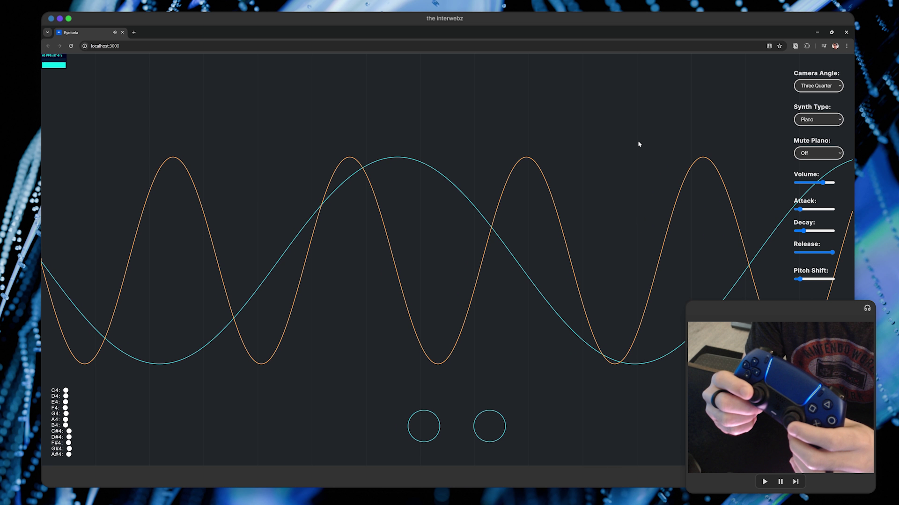

# Gamepad MIDI Oscillation

Uses analog stick input from a gamepad to control the frequency of 2 MIDI oscillators. Built with ReactJS, ToneJS, and P5JS.

## Getting Started

1. Clone this repo.
1. Install dependencies: `yarn`
1. Run the development server: `yarn dev`
1. See the site here 👀: http://localhost:3000/

### Lint and Code Formatting

If you use VSCode, Prettier should run each time you save a compatible file.

> If you don't like this, go to `.vscode\settings.json` and disable there (or you can do it via your own VSCode settings).

`yarn lint` runs ESLint and Prettier, automatically formats files and rewrites them. Make sure to stage your code before running just in case.

### Upgrading to latest

1. `yarn upgrade-interactive --latest`

> Please note that when you update a major version, you should check the dependency's documentation to see if there are any necessary changes to make to app or dependency API.

## How to use

This is based off my [r3f-next-starter](https://github.com/whoisryosuke/r3f-next-starter) project. Check out those docs for more details.

### DOM vs R3F

When you create a new page, you don't need to wrap anything in a canvas. This automatically happens in the `_app.jsx` file.

Each page should export `<DOM />` and `<R3f />` components. DOM first, then R3F second. The components can be named anything, even be blank (like no DOM elements).

```tsx
// newPage.tsx

// DOM elements here
const DOM = () => {
  return (
    <>
      <h1>Hello world</h1>
    </>
  );
};

// Canvas/R3F components here
const R3F = () => {
  return (
    <>
      <YourR3FComponent />
      <ThreeDBox />
      <Sphere />
    </>
  );
};

export default function Page() {
  return (
    <>
      <DOM />
      <R3F r3f />
    </>
  );
}
```

### Page Titles

You can use `getStaticProps` to pass a `title` prop. This gets passed to the `<Header />` component, which adds it to the page title. The **page title** is combined with your **site title** in the `site.config.js` (e.g. `Page 1 - Website Name`).

```tsx
export async function getStaticProps() {
  return {
    props: {
      title: "Welcome!",
    },
  };
}
```

### Where is Canvas?

The `<Canvas>` is located in `src\components\layout\canvas.jsx`. You can add any components here you want to share across all scenes (like a similar camera, lighting, etc).

If you need to have a **separate canvas per page** for any reason, you can just remove it from `_app.js` and return the R3F child:

```tsx
// src\pages\_app.tsx
const AppLayout = ({ children }) => {
  const newChildren = React.Children.map(children, (child, index) =>
    // 👉 Remove the <Canvas> here (which I already did in this example)
    index % 2 === 0 ? <Dom>{child}</Dom> : <>{child}</>
  );

  return newChildren;
};
```

### Importing R3F components

The rule is: you have to dynamically import any React component that uses ThreeJS/R3F components if it's the **top-level component**. Once you dynamically import that React component -- it can contain other ThreeJS/R3F component without dynamic imports.

See the `/pages/` and `/components/canvas/` for examples.

### Importing media (audio, video, etc)

1. Place media in `/public/` folder.
1. Use a relative URL to your media (`yoursite.com/video.mp4` if it's in `public/video.mp4`).

## Snippets

This project features VSCode snippets for quickly creating R3F components and patterns. You can find them and add more in `.vscode\r3f.code-snippets`.

- `r3fc` - Create R3F mesh
- `r3fg` - Create R3F group
- `tsr3fc` - Create R3F mesh (with Typescript)
- `tsr3fg` - Create R3F group (with Typescript)

## Tips

### Syntax Highlighting for Shaders

When you browse the shaders (`.frag` and `.vert`) in VSCode, you should see a popup to install a plugin for highlighting.

There's a few, but we recommend [Shader languages support for VS Code](https://marketplace.visualstudio.com/items?itemName=slevesque.shader).

## Typescript Guide

Check out [our guide on using R3F with Typescript.](./docs/typescript.md) And try using [the Typescript snippets](#snippets) for faster workflows.

## Credits

- [r3f-next-starter](https://github.com/whoisryosuke/r3f-next-starter)
- [ToneJS](https://github.com/Tonejs/Tone.js)
- [webmidi](https://github.com/djipco/webmidi)
